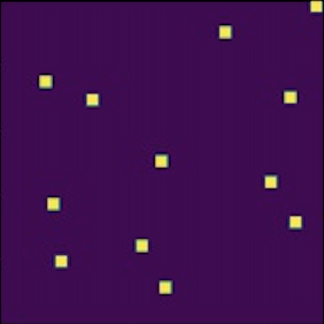
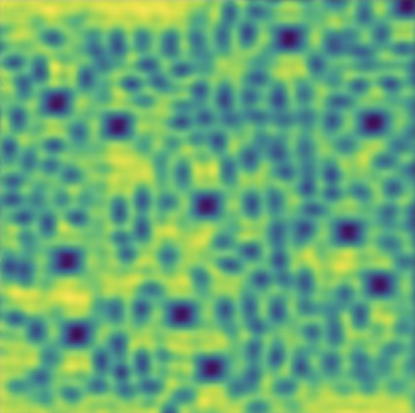
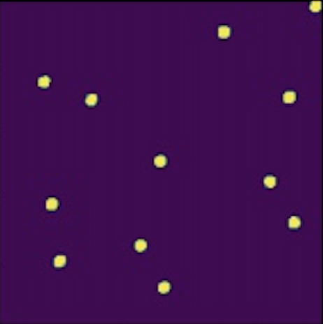
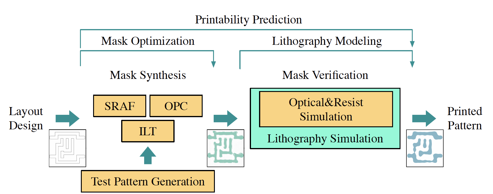

# LithoNet

LithoNet is a learning-based lithography simulation and mask optimization toolkit. Considering the analogy between image translation and lithography computation flow, LithoNet attempts to replace the conventional Lithography Simulation and ILT (Inverse Lithography Technology) processes with GAN-based image inference and generation. With golden datasets produced by commercial software (e.g. Synopsys S-Litho) based on rigorous numerical calculation, LithoNet has the following features:

- Both lithography simulation flow and ILT flow are implemented.
- Much faster process and acceptable quality, compared with commercial tools.
- EPE (Edge Placement Error)-aware training and EPE distribution measurement for all contacts.
- Easy for customization with your own datasets and upgradation.
- ...

**Example results** 
| Target Layout | Synthesized Mask | Aerial Image | Actual Layout |
| --- | --- | --- | --- |
|  |  |  | 

**Reference Flow** [*(Lin, ASPDAC'21)*](https://dl.acm.org/doi/10.1145/3394885.3431624)


## Prerequisites
- Python3
- Nvidia GPU and CUDA
- Pytorch (1.4+) and other dependencies (e.g., torchvision, opencv)
    - For pip users, please type the command `pip install -r requirements.txt`
    - For Conda users, create a new Conda environment using `conda env create -f environment.yml`

## Getting Started
### Installation
- Clone this repo:
```shell
git clone https://github.com/xinming-wei/LithoNet
cd LithoNet
```

### Lithography Simulation
- **Input:** mask.
- **Output:** aerial image (intensity map).
#### Customize with Your Own Dataset

- Put corresponding items in `./datasets/litho_simul/train/mask` and `./datasets/litho_simul/train/aerial_image` respectively for training, and similarly for testing in `./datasets/litho_simul/test/`
- Only one `.npz` file is needed in each subfolder, you can name it casually but its index should be like `np.load('masks.npz')['0066']`. Do it by:
    ```python
    import numpy as np
    mask_dict = {}
    for i, image in enumerate(images):
        mask_dict['{:04}'.format(i)] = image
    np.savez('./datasets/litho_simul/train/mask/masks.npz', **mask_dict)
    ```
- It's your job to keep the shape of images and the number of samples in paired datasets (e.g. masks and aerial images) aligned.
- I have placed some example datasets with few images in the folders. You need to replace them with yours before training.

#### Train and Test
- Train with the default 256x256 resolution:
  ```shell
  #!./scripts/train_lithosimul.sh
  python train.py --phase litho_simul
  ```
- Test the model:
  ```shell
  #!./scripts/test_lithosimul.sh
  python test_lithosimul.py --plot
  ```
- The test results will be saved as log files and images. You can find them in `./checkpoints/litho_simul/test_results/`.


### ILT Flow
- **Input**: target layout.
- **Output**: optimized mask (e.g. with OPC and SRAF).
- Pretrained lithography simulation model is required to train ILT.
#### Pretrain
- Like training lithography simulation model, you need to add your own dataset to `./datasets/ilt_pretrain/`. Here aligned layout and mask datasets are required to pretrain the ILT generator:
  ```shell
  #!./scripts/train_ilt_pretrain.sh
  python train.py --phase pretrain
  ```
#### Finetune
- At the finetune stage, the pretrained model is further refined with decreased learning rate and fewer epochs. In an unsupervised manner, only input target layout data is needed.  Losses are computed based on the L2 error between target layout and actual wafer image.
- To prepare the datasets, use the `./util/RandomClip/RandomClip.py` to generate any number of layout images with your own configuration. Then put the `.npz` files under `./datasets/ilt_finetune/train` and `./datasets/ilt_finetune/test`.
- You need to specify the threshold for slicing aerial image with continuous pixel value into binary printed layout (i.e. a canonical resist model). Use `--aerial_thresh` to set the value when training.
- Train the finetune model:
  ```shell
  #!./scripts/train_ilt_finetune.sh
  python train.py --phase finetune --aerial_thresh [(float)your chosen value]
  ```
- Test the final ILT model:
  ```shell
  #!./scripts/test_ilt.sh
  python test_ilt.py --plot --aerial_thresh [(float)your chosen value]
  ```
- You can adjust the learning rate or training epochs by specifying `--lr` and `--n_epochs`, `--n_epochs_decay`. The test results (EPE per contact, test images and EPE distribution) will be saved in `./checkpoints/ilt_finetune/test_results/`.

### More Training/Testing Details
- There are more options you can use (e.g. train on multiple GPUs, change batch size and epochs, switch to a higher resolution). 
- Check the details in `./options`. see `./options/base_options.py` and `./options/train_options.py` for all the train flags; see `./options/base_options.py` and `./options/test_options.py` for all the test flags.

### Acknowledgements
- We would like to thank [Synopsys, Inc.](https://www.synopsys.com/) for supplying us with Sentaurus Lithography (S-Litho) to generate datasets and verify mask quality. This model also borrows heavily from [pytorch-CycleGAN-and-pix2pix](https://github.com/junyanz/pytorch-CycleGAN-and-pix2pix).
- The tool still suffers from mask quality problems, **so pull requests to improve the model are always welcome.**


      
